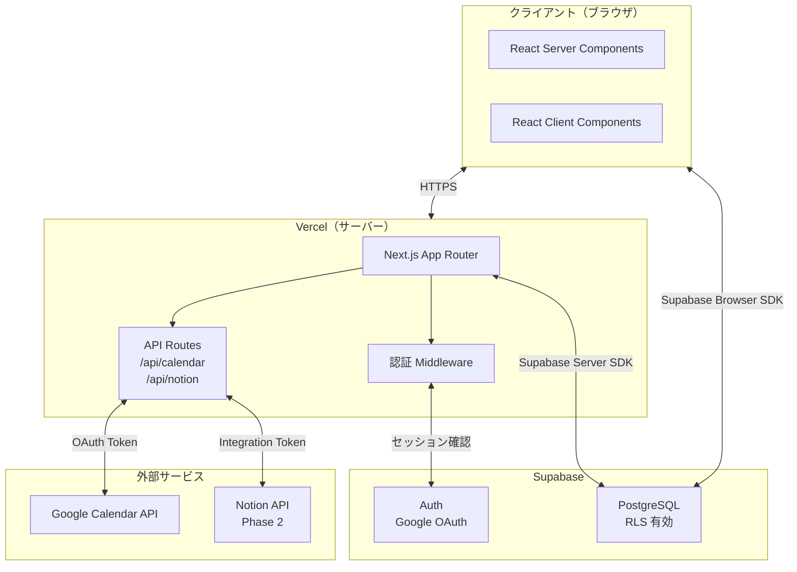
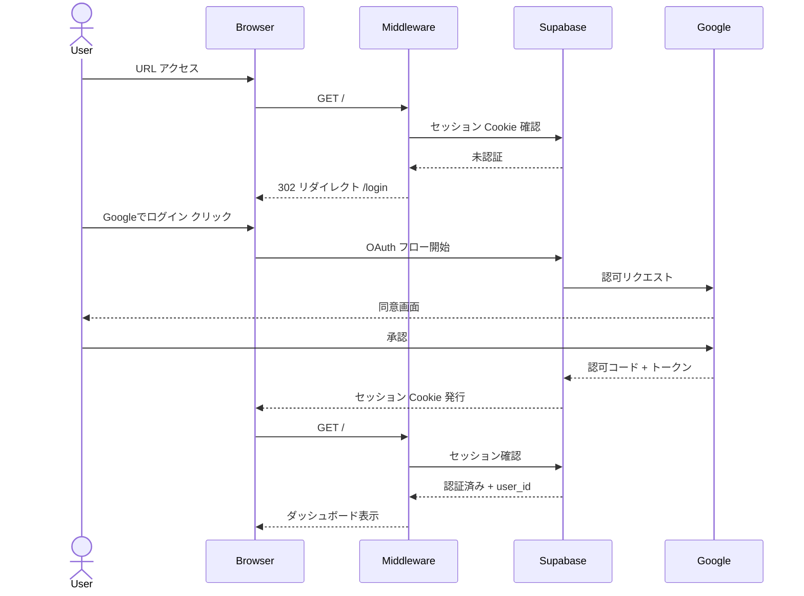
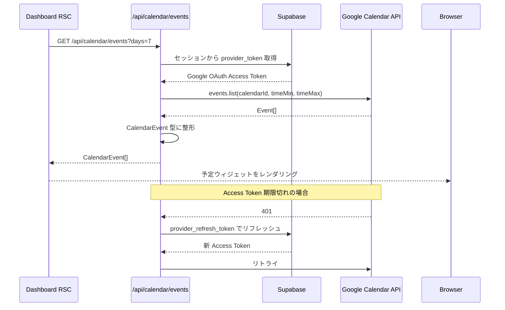
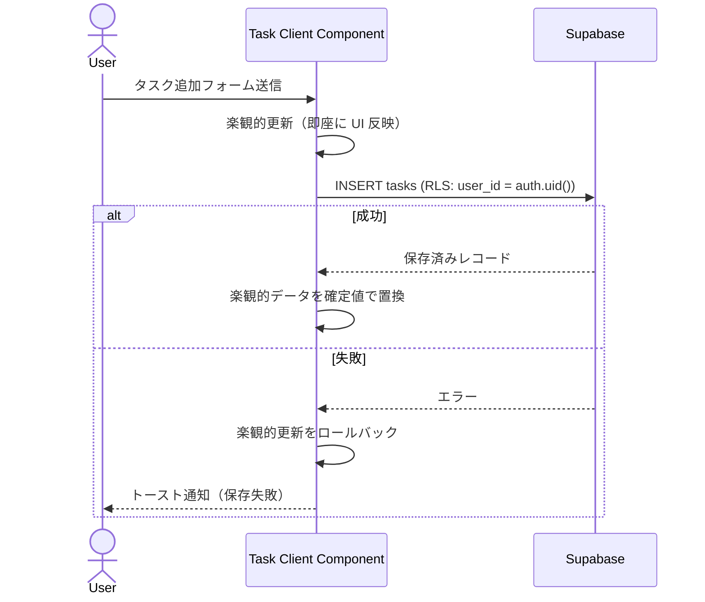
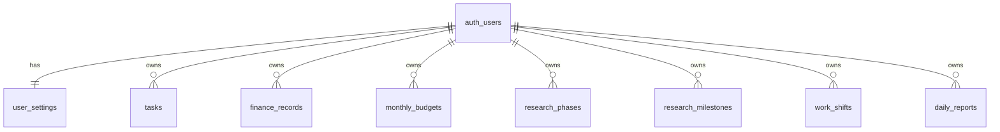
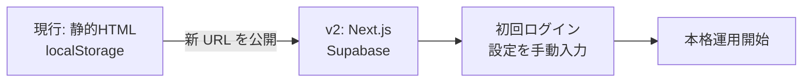

# 技術設計書 — My Compass v2

## Overview

My Compass v2 は、個人の生活・研究・仕事の状況を一画面で把握するための個人用ダッシュボードを、マルチデバイス対応の本格的な Web アプリとして再構築するプロジェクトである。現行の HTML/CSS/Vanilla JS 静的プロトタイプを、Next.js + Supabase + Vercel の構成に移行し、インターネット経由でどの端末からでもアクセスできるようにする。

データは Supabase PostgreSQL に永続化してクロスデバイス同期を実現し、Google Calendar との連携により外部サービスの最新情報を自動取得する。認証は Google OAuth のシングルユーザーログインとし、外部サービスの API トークンはすべてサーバーサイドの環境変数で管理してフロントエンドには露出しない。

### Goals

- スマホ・PC・タブレットの任意のブラウザから HTTPS でアクセスできる
- データ変更が端末をまたいでリアルタイムに反映される
- Google Calendar の予定がサーバー経由で自動取得される
- API トークン・DB 接続文字列がブラウザに一切届かない

### Non-Goals

- 複数ユーザーへの対応
- Notion 連携の即時実装（第二フェーズとして設計のみ定義）
- モバイルネイティブアプリ（iOS / Android）の開発
- 高可用性・SLA 保証（個人用途のためベストエフォート）

---

## Architecture

### High-Level Architecture



### Technology Stack

| レイヤー | 技術 | 選定理由 |
|---------|------|---------|
| フレームワーク | Next.js 15（App Router） | RSC でサーバー側データ取得、API Routes でプロキシ、Vercel との親和性 |
| 言語 | TypeScript | 型安全性・補完 |
| スタイリング | Tailwind CSS | 既存デザイン（白・濃紺）を素早く再現、モバイルファーストのレスポンシブ |
| DB / Auth | Supabase | PostgreSQL + Google OAuth + RLS が一体、無料枠で個人用途に十分 |
| ホスティング | Vercel | Next.js と最適化された統合、HTTPS・CDN・Edge Middleware |
| 外部連携（Cal） | Google Calendar API v3 | googleapis ライブラリ、OAuth トークンをログイン認証と共有 |
| 外部連携（Notion） | Notion API v1（Phase 2） | @notionhq/client |

### UI デザイントークン（確定）

index.html プロトタイプをブラウザレビューし承認済み（2026-06-22）。Tailwind CSS カスタムプロパティとして実装する。

#### カラーパレット

| トークン | 値 | 用途 |
|---------|----|----|
| `--navy` | `#0b2d4e` | サイドバー背景・見出し・主要テキスト |
| `--accent` | `#d4935c` | アクティブナビ左バー・今日シフトバッジ・バイト進捗バー・ロゴ枠線（`--orange` のエイリアス） |
| `--blue` | `#2563eb` | アクションボタン・リンク・収入バーグラフ |
| `--green` | `#2f9470` | タスク完了・研究進捗 |
| `--cyan` | `#3b9fc5` | 研究マイルストーン（分析フェーズ） |
| `--red` | `#cc5b68` | エラー・アラート |
| `--bg` | `#f3f5f8` | ページ背景 |
| `--paper` | `#ffffff` | カード背景 |
| `--line` | `#e2e8f0` | ボーダー・区切り線 |
| `--muted` | `#6b7c93` | サブテキスト・ラベル |
| `--ink` | `#172033` | 本文テキスト |

アクセントカラーは `--accent`（アンバー）1色に集約し、散在していた orange / cyan 系アクセントを廃止する。

#### タイポグラフィ

| 要素 | font-size | font-weight | 備考 |
|------|-----------|-------------|------|
| メトリクス数値 | `2.25rem` | `800` | `letter-spacing: -0.05em`, `font-variant-numeric: tabular-nums`, `line-height: 1` |
| 財務合計数値 | `25px` | `800` | `font-variant-numeric: tabular-nums` |
| ページ見出し h1 | `27px` | `800` | `letter-spacing: -0.04em` |
| カードタイトル | `12px` | `700` | |
| ラベル / eyebrow | `9px` | `700` | `letter-spacing: 0.08em`, uppercase |

#### カードスタイル

| プロパティ | 値 |
|-----------|---|
| `border-radius` | `12px` |
| `box-shadow` | `0 1px 2px rgba(11,45,78,.04), 0 3px 12px rgba(11,45,78,.06)` |
| `border` | `1px solid #e2e8f0` |

#### サイドバー

- 背景: `#0b2d4e` + 斜めラインテクスチャ（SVG data URI, `stroke-opacity: 0.07`, pitch 24px）
- アクティブ項目左バー: `inset 4px 0 var(--accent)`
- ロゴマーク枠: `1.5px solid var(--accent)`

#### ホームダッシュボード グリッドレイアウト（12カラム）

| 行 | カード | span |
|---|------|------|
| 1 | メトリクスカード × 4 | 各 3 |
| 2 | 今日やること | 5 |
| 2 | 研究プロジェクト | 7 |
| 3 | バイト状況 | 5 |
| 3 | アプリランチャー | 7 |
| 4 | 今週の予定 | 12 |

> 収支の推移（棒グラフ）カードを削除。バイト状況カード（勤務時間プログレス・収入見込み・直近シフト）を新設。

#### バイト状況カード構成要素

- 今月勤務時間プログレスバー（アンバー色）
- 収入見込み / 時給 / 残シフト数（3カラムフッター）
- 直近シフトリスト（「今日」バッジはアンバー背景 `#d4935c`）

---

### Key Design Decisions

#### Decision 1: React Server Components を主なデータ取得経路とする

- **Context**: 外部 API トークンをブラウザに露出せずにデータを表示する必要がある
- **Alternatives**: ① クライアント側 fetch（トークン露出リスク） ② 従来の getServerSideProps（旧 Pages Router）
- **Selected Approach**: App Router の RSC でサーバー上で Supabase / API Route を呼び出し、HTML として配信する。インタラクティブな部分（フォーム・チェックボックス等）のみ Client Component とする
- **Rationale**: トークンがネットワークに流れない。初期表示が速い。セキュリティモデルが明快
- **Trade-offs**: リアルタイム更新は Supabase Realtime または SWR による再検証で補う

#### Decision 2: Supabase Auth（Google Provider）を認証基盤とする

- **Context**: シングルユーザーの Google OAuth + セッション管理 + DB の RLS を統合する必要がある
- **Alternatives**: ① NextAuth.js（セッション管理は別途必要） ② Auth0（無料枠が限定的）
- **Selected Approach**: Supabase Auth の Google プロバイダーを使用する。セッションは Supabase が管理し、RLS ポリシーで `auth.uid()` を参照する
- **Rationale**: Supabase Auth ↔ RLS ↔ DB が同一プラットフォームで統合される。トークンの自動リフレッシュが組み込まれている
- **Trade-offs**: Supabase への依存度が高まるが、個人用途では許容範囲

#### Decision 3: Google Calendar 連携を Phase 1、Notion を Phase 2 とする

- **Context**: 両者の連携が要件だが、実装コストと優先度を整理する必要がある
- **Selected Approach**: Google Calendar は Google ログインと OAuth スコープを共有でき、かつ読み取り専用で実装が単純なため Phase 1 で実装する。Notion は別途 Integration Token が必要で設計が複雑なため Phase 2 とする
- **Rationale**: 認証の二度手間なく Google Calendar を実装できる。Notion 連携のスキーマ設計は後続フェーズで独立して検討できる

---

## System Flows

### 認証フロー



### Google Calendar 取得フロー



### タスク CRUD フロー



---

## Components and Interfaces

### アプリケーション構造

```
src/
├── app/
│   ├── (auth)/login/page.tsx          # 認証不要ページ
│   ├── (dashboard)/
│   │   ├── layout.tsx                 # サイドバー + ヘッダー
│   │   ├── page.tsx                   # ホームダッシュボード
│   │   ├── tasks/page.tsx
│   │   ├── finance/page.tsx
│   │   ├── research/page.tsx
│   │   ├── work/page.tsx
│   │   ├── reports/page.tsx           # 日報
│   │   ├── schedule/page.tsx
│   │   └── apps/page.tsx
│   └── api/
│       ├── calendar/events/route.ts
│       ├── calendar/calendars/route.ts
│       └── notion/sync/route.ts       # Phase 2
├── components/
│   ├── ui/                            # Button, Card, Modal, Toast 等
│   ├── layout/                        # Sidebar, Header, NavItem
│   └── features/
│       ├── home/                      # MetricCard, TaskWidget, ScheduleWidget
│       ├── tasks/                     # TaskList, TaskForm, TaskItem
│       ├── finance/                   # FinanceChart, RecordForm
│       ├── research/                  # ProgressBar, MilestoneList
│       ├── work/                      # ShiftCalendar, EarningsCard
│       ├── reports/                   # ReportForm, ReportList
│       └── schedule/                  # WeeklyView, EventCard
├── lib/
│   ├── supabase/server.ts             # createServerClient
│   ├── supabase/browser.ts            # createBrowserClient
│   ├── google-calendar/client.ts      # Google API ラッパー
│   └── utils/
├── types/index.ts                     # 共有型定義
└── middleware.ts                      # 認証ガード
```

### 認証 Middleware

**Responsibility**: 未認証リクエストを `/login` にリダイレクトし、認証済みユーザーが `/login` にアクセスした場合は `/` にリダイレクトする。

**Contract**:

```typescript
// middleware.ts
// matcher: ['/((?!_next/static|_next/image|favicon.ico|login).*)']
// セッション有効 → next()
// セッション無効 → Response.redirect('/login')
```

### API Route: Google Calendar

**Responsibility**: サーバーサイドで Google Calendar API を呼び出し、ブラウザにトークンを露出しない。

**API Contract**:

| Method | Endpoint | Request | Response | Errors |
|--------|----------|---------|----------|--------|
| GET | /api/calendar/events | `?days=7&calendarIds=...` | `CalendarEvent[]` | 401, 502 |
| GET | /api/calendar/calendars | — | `CalendarInfo[]` | 401, 502 |

```typescript
interface CalendarEvent {
  id: string
  title: string
  startAt: string      // ISO 8601
  endAt: string
  isAllDay: boolean
  calendarId: string
  calendarName: string
}

interface CalendarInfo {
  id: string
  name: string
  color: string
}
```

### API Route: Notion（Phase 2）

| Method | Endpoint | Request | Response | Errors |
|--------|----------|---------|----------|--------|
| POST | /api/notion/sync | `{ databaseId: string }` | `SyncResult` | 401, 422, 502 |
| PATCH | /api/notion/tasks/[id] | `{ completed: boolean }` | `NotionTask` | 401, 404, 502 |

---

## Data Models

### 物理データモデル（Supabase PostgreSQL）



#### tasks

| カラム | 型 | 制約 | 説明 |
|--------|-----|------|------|
| id | uuid | PK, DEFAULT gen_random_uuid() | |
| user_id | uuid | FK auth.users, NOT NULL | RLS 用 |
| title | text | NOT NULL | |
| description | text | | |
| priority | text | CHECK IN ('high','medium','low') | デフォルト 'medium' |
| due_date | date | | |
| category | text | | |
| completed | boolean | DEFAULT false | |
| completed_at | timestamptz | | |
| notion_id | text | | Phase 2 連携用 |
| created_at | timestamptz | DEFAULT now() | |
| updated_at | timestamptz | DEFAULT now() | |

#### finance_records

| カラム | 型 | 制約 | 説明 |
|--------|-----|------|------|
| id | uuid | PK | |
| user_id | uuid | FK, NOT NULL | |
| amount | integer | NOT NULL | 円単位 |
| type | text | CHECK IN ('income','expense') | |
| category | text | NOT NULL | |
| date | date | NOT NULL | |
| memo | text | | |
| created_at | timestamptz | DEFAULT now() | |

#### monthly_budgets

| カラム | 型 | 制約 | 説明 |
|--------|-----|------|------|
| id | uuid | PK | |
| user_id | uuid | FK, NOT NULL | |
| year_month | text | NOT NULL | 例: '2026-06' |
| budget_amount | integer | NOT NULL | 円単位 |
| UNIQUE | (user_id, year_month) | | |

#### research_phases

| カラム | 型 | 制約 | 説明 |
|--------|-----|------|------|
| id | uuid | PK | |
| user_id | uuid | FK, NOT NULL | |
| phase_key | text | NOT NULL | 'literature_review' 等 |
| phase_name | text | NOT NULL | 表示名 |
| progress | integer | CHECK 0–100, DEFAULT 0 | |
| sort_order | integer | DEFAULT 0 | |
| UNIQUE | (user_id, phase_key) | | |

#### research_milestones

| カラム | 型 | 制約 | 説明 |
|--------|-----|------|------|
| id | uuid | PK | |
| user_id | uuid | FK, NOT NULL | |
| title | text | NOT NULL | |
| due_date | date | | |
| achieved | boolean | DEFAULT false | |
| achieved_at | timestamptz | | |

#### work_shifts

| カラム | 型 | 制約 | 説明 |
|--------|-----|------|------|
| id | uuid | PK | |
| user_id | uuid | FK, NOT NULL | |
| date | date | NOT NULL | |
| start_time | time | NOT NULL | |
| end_time | time | NOT NULL | |
| hourly_rate | integer | NOT NULL | 円/時 |
| transport_fee | integer | DEFAULT 0 | 円 |
| confirmed | boolean | DEFAULT false | 勤務確定フラグ |

#### daily_reports

| カラム | 型 | 制約 | 説明 |
|--------|-----|------|------|
| id | uuid | PK | |
| user_id | uuid | FK, NOT NULL | |
| report_date | date | NOT NULL | |
| done_today | text | | 今日やったこと |
| insights | text | | 気づき・メモ |
| tomorrow_plan | text | | 明日やること |
| UNIQUE | (user_id, report_date) | | |

#### user_settings

| カラム | 型 | 制約 | 説明 |
|--------|-----|------|------|
| id | uuid | PK | |
| user_id | uuid | FK, NOT NULL, UNIQUE | |
| obsidian_vault_name | text | | |
| notion_home_url | text | | |
| custom_apps | jsonb | DEFAULT '[]' | `{label, url}[]` |
| calendar_ids | jsonb | DEFAULT '[]' | 選択中のカレンダー ID[] |

### 行レベルセキュリティ（RLS）ポリシー

全テーブルに以下のポリシーを適用する。

```sql
-- 全テーブル共通パターン
ALTER TABLE tasks ENABLE ROW LEVEL SECURITY;

CREATE POLICY "users can manage own tasks"
  ON tasks FOR ALL
  USING (auth.uid() = user_id)
  WITH CHECK (auth.uid() = user_id);
```

### TypeScript 共有型定義

```typescript
// types/index.ts

export type Priority = 'high' | 'medium' | 'low'
export type FinanceType = 'income' | 'expense'

export interface Task {
  id: string
  userId: string
  title: string
  description: string | null
  priority: Priority
  dueDate: string | null    // ISO date string
  category: string | null
  completed: boolean
  completedAt: string | null
  notionId: string | null
  createdAt: string
  updatedAt: string
}

export interface FinanceRecord {
  id: string
  userId: string
  amount: number
  type: FinanceType
  category: string
  date: string
  memo: string | null
  createdAt: string
}

export interface WorkShift {
  id: string
  userId: string
  date: string
  startTime: string
  endTime: string
  hourlyRate: number
  transportFee: number
  confirmed: boolean
}

export interface DailyReport {
  id: string
  userId: string
  reportDate: string
  doneToday: string | null
  insights: string | null
  tomorrowPlan: string | null
  createdAt: string
  updatedAt: string
}

export interface CalendarEvent {
  id: string
  title: string
  startAt: string
  endAt: string
  isAllDay: boolean
  calendarId: string
  calendarName: string
}
```

---

## Error Handling

### エラー戦略

ユーザーに見えるエラーはトースト通知で表示し、操作のロールバックを行う。API エラーはサーバーログに記録してクライアントには安全なメッセージのみ返す。

### エラーカテゴリと対応

| カテゴリ | 例 | 対応 |
|---------|-----|------|
| 認証エラー（401） | セッション切れ | `/login` へリダイレクト |
| 入力エラー（400） | 不正な URL・空タイトル | フィールド下にインラインエラー表示 |
| 外部 API エラー（502） | Google Calendar 取得失敗 | キャッシュデータを表示 + エラー表示 |
| DB エラー（500） | Supabase 保存失敗 | トースト通知 + 楽観的更新のロールバック |
| ネットワーク切断 | オフライン | Service Worker キャッシュを表示 + オフラインバナー |

### API Route のエラーレスポンス形式

```typescript
interface ApiError {
  code: string    // 'UNAUTHORIZED' | 'CALENDAR_FETCH_FAILED' | ...
  message: string // ユーザーフレンドリーなメッセージ（日本語）
}
```

---

## Testing Strategy

### Unit Tests（Vitest）

- `lib/google-calendar/client.ts`: トークンリフレッシュ処理・イベント整形ロジック
- `lib/utils/`: 給与計算・進捗率計算・日付フォーマット関数
- `types/`: 型ガード関数

### Integration Tests（Vitest + MSW）

- `/api/calendar/events`: Google Calendar API をモックしてレスポンス整形を検証
- Supabase CRUD: supabase-js のモックを使い RLS ロジックを検証
- Middleware: 未認証・認証済みの各リダイレクト動作を検証

### E2E Tests（Playwright）

- 認証フロー: Google OAuth → ダッシュボード表示（テスト用アカウントを使用）
- タスク CRUD: 追加 → 完了チェック → 削除の一連操作
- Google Calendar 表示: API モックで取得〜表示を検証
- 日報: 作成 → 編集 → 過去日付の参照
- レスポンシブ: 320px・768px・1440px の各幅でレイアウト崩れがないことを確認

---

## Security Considerations

### トークン管理

- Google OAuth Access Token / Refresh Token は Supabase Auth が管理し、API Route 経由でのみ使用する
- Notion Integration Token は Vercel 環境変数に保存し、API Route からのみアクセスする
- ブラウザに送信する JSON レスポンスにトークン類を含めない

### 入力検証

- URL フィールド: `URL` コンストラクタで検証し、`https:` / `http:` / `obsidian:` のみ許可
- テキスト入力: Supabase クライアントがパラメータ化クエリを使用するため SQL インジェクションは防止される
- HTML 出力: React の JSX はデフォルトでエスケープするため XSS は防止される

### 許可ユーザーの制限

- Supabase Auth の `auth.users` テーブルに登録された Google アカウントのみアクセス可能
- 環境変数 `ALLOWED_EMAIL` で許可メールアドレスを定義し、Middleware で照合する

### セキュリティヘッダー

Vercel の `next.config.ts` で以下を設定する。

```typescript
headers: [
  { key: 'X-Frame-Options', value: 'DENY' },
  { key: 'X-Content-Type-Options', value: 'nosniff' },
  { key: 'Referrer-Policy', value: 'strict-origin-when-cross-origin' },
]
```

---

## Migration Strategy

現行プロトタイプは実データを持たないため、データ移行は不要である。localStorage に保存されている設定値（Vault 名・Notion URL）のみ、初回ログイン時に手動で `user_settings` テーブルに移行する。



### フェーズ

| フェーズ | 内容 |
|---------|------|
| Phase 1 | Next.js + Supabase 基盤構築・認証・タスク管理・Google Calendar 連携 |
| Phase 2 | 財務・研究・アルバイト・日報の実データ化 |
| Phase 3 | Notion 連携・CSV エクスポート・PWA 対応 |
